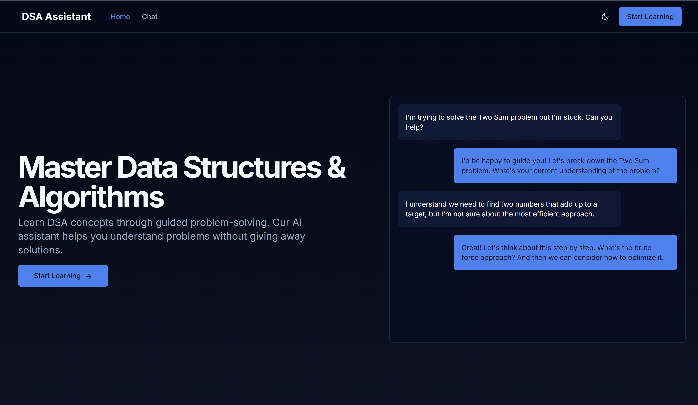
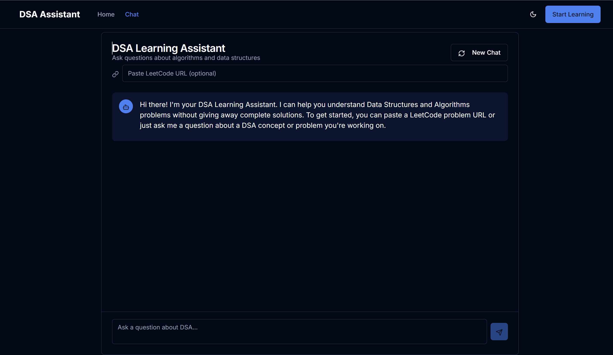
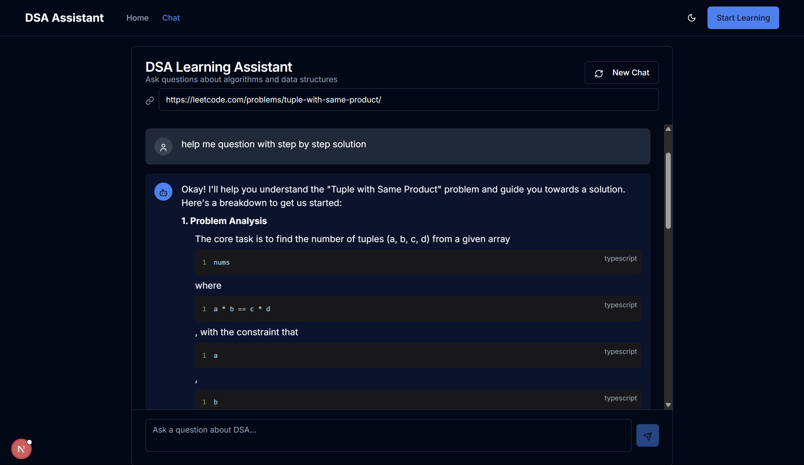

# DSA Learning Assistant 🤖

[](https://nextjs.org/)
[](https://ai.google.dev/)

A smart chat-based teaching assistant for Data Structures & Algorithms problems, powered by Google's Gemini API and Next.js.

Home Page Preview



Chat Interface Preview





## 🚀 Features

* **Intelligent Guidance System**
  * LeetCode problem analysis from URLs
  * Step-by-step problem solving assistance
  * Progressive hint system (Tier 1 → Tier 3 hints)
  * Complexity analysis (time/space)
* **Interactive Chat Experience**
  * Real-time message threading
  * Markdown-supported responses
  * Context-aware conversation history
  * Rate limiting and error handling
* **Educational Focus**
  * Socratic questioning methodology
  * Visual problem-solving suggestions
  * Related problem recommendations
  * Common mistake prevention tips

## 🛠️ Tech Stack

**Frontend**

* Next.js 14 (App Router)
* React + Tailwind CSS
* TypeScript

**Backend**

* Google Gemini API
* Next.js API Routes
* Rate limiting
* Secure API key management

## 📦 Installation

1. **Clone the repository**

bash

Copy

```
git clone https://github.com/boora-aman/DSA_Assistant.git
```

2. **Install dependencies**

bash

Copy

```
npm install
```

3. **Environment Setup**

bash

Copy

```
cp .env.local.example .env.local
```

Add your Gemini API key:

env

Copy

```
GEMINI_API_KEY=your_api_key_here
```

4. **Run development server**

bash

Copy

```
npm run dev
```

## 🧠 Architecture

```
DSA_Assistant/
└── DSA_Assistant
    ├── .env.local                 # Local environment variables (not committed to Git)
    ├── .env.local.example         # Example environment variables for reference
    ├── app                        # Main application directory
    │   ├── api                    # API routes
    │   │   └── chat
    │   │       └── route.ts       # Backend logic for chat API
    │   ├── chat                   # Chat-related frontend components
    │   │   ├── loading.tsx        # Loading screen for chat
    │   │   └── page.tsx           # Main chat page component
    │   ├── globals.css            # Global styles
    │   ├── layout.tsx             # Main layout for the app
    │   └── page.tsx               # Main page component
    ├── components                 # Reusable UI components
    │   ├── chat-message.tsx       # Chat message component
    │   ├── demo-section.tsx       # Demo section component
    │   ├── feature-section.tsx    # Features section component
    │   ├── header.tsx             # Header component
    │   ├── hero-section.tsx       # Hero section (landing page)
    │   ├── theme-provider.tsx     # Manages theme (dark/light mode)
    │   └── ui                     # Additional UI components
    ├── components.json            # Configuration for components (if any)
    ├── hooks                      # Custom React hooks
    │   ├── use-mobile.tsx         # Hook to check for mobile devices
    │   └── use-toast.ts           # Hook for showing toast notifications
    ├── image                      # Image assets
    │   └── readme                 # Images for documentation/readme
    │       ├── 1740931420127.png  
    │       ├── 1740931539944.png  
    │       └── 1740936258324.png  
    ├── lib                        # Utility functions and libraries
    │   ├── use-chat.ts            # Custom hook for chat functionality
    │   └── utils.ts               # Utility functions
    ├── next-env.d.ts              # TypeScript environment definitions for Next.js
    ├── next.config.mjs            # Next.js configuration file
    ├── package.json               # Dependencies and scripts for the project
    ├── postcss.config.mjs         # PostCSS configuration (used for Tailwind)
    ├── public                     # Public assets (accessible via URL)
    │   ├── placeholder-logo.png   
    │   ├── placeholder-logo.svg   
    │   ├── placeholder-user.jpg   
    │   ├── placeholder.jpg        
    │   └── placeholder.svg        
    ├── readme.md                  # Project documentation
    ├── styles                     # Styling-related files
    │   └── globals.css            # Global CSS styles
    ├── tailwind.config.js         # Tailwind CSS configuration
    ├── tsconfig.json              # TypeScript configuration
    └── vercel.json                # Vercel deployment configuration

```

### Key Components

1. **Prompt Engineering System**
   * Dynamic system prompts based on problem context
   * Tiered hint generation (Concept → Implementation)
   * Response validation and sanitization
2. **Conversation Management**
   * Message threading with context preservation
   * Rate limiting (5 requests/minute)
   * Error recovery mechanisms
3. **Learning Analytics**
   * Problem difficulty tracking
   * User progress monitoring
   * Interaction quality metrics

## 💡 Usage Guide

1. **Submit a LeetCode Problem**

   * Paste any LeetCode URL in the input field
   * Example: `https://leetcode.com/problems/two-sum/`
2. **Ask Questions**
   text

   Copy

   ```
   "How would I approach the Two Sum problem?"
   "What data structure works best here?"
   "Can you explain the time complexity?"
   ```
3. **Receive Guidance**

   * Conceptual explanations
   * Step-by-step breakdowns
   * Visual problem-solving suggestions
   * Complexity analysis
4. **Use Advanced Features**

   * Request hints: "Give me a Tier 2 hint"
   * Get examples: "Show me a test case"
   * Compare approaches: "Brute force vs optimal"

## 🔧 GPT Integration

### Prompt Engineering Strategy

javascript

Copy

```
const systemPrompt = `
Role: DSA Tutor
Objective: Guide without solutions
Methodology:
1. Analyze problem constraints
2. Identify core DSA concepts
3. Generate Socratic questions
4. Provide tiered hints
5. Suggest visualization techniques

Rules:
- Never write complete code
- Always ask follow-up questions
- Use markdown formatting
- Include complexity analysis
`;
```

### Response Handling

typescript

Copy

```
interface GuidanceResponse {
  question: string;
  concepts: string[];
  hints: string[];
  visualization?: string;
  complexity: {
    time: string;
    space: string;
  };
  relatedProblems: string[];
}
```

## 🌟 Best Practices

1. **For Users**
   * Start with problem URL submission
   * Be specific in your questions
   * Ask for complexity analysis
   * Request visual explanations when stuck
2. **For Developers**
   * Maintain .env.local for secrets
   * Use `npm run lint` for code quality
   * Test with different problem types
   * Monitor API usage quotas

## 📈 Future Roadmap

* Collaborative problem solving
* Code submission analysis
* Progress tracking dashboard
* Mobile app integration

## 🤝 Contributing

1. Fork the repository
2. Create feature branch (`git checkout -b feature/amazing-feature`)
3. Commit changes (`git commit -m 'Add amazing feature'`)
4. Push to branch (`git push origin feature/amazing-feature`)
5. Open Pull Request

## 📜 License

MIT License - See [LICENSE](https://license/) for details
